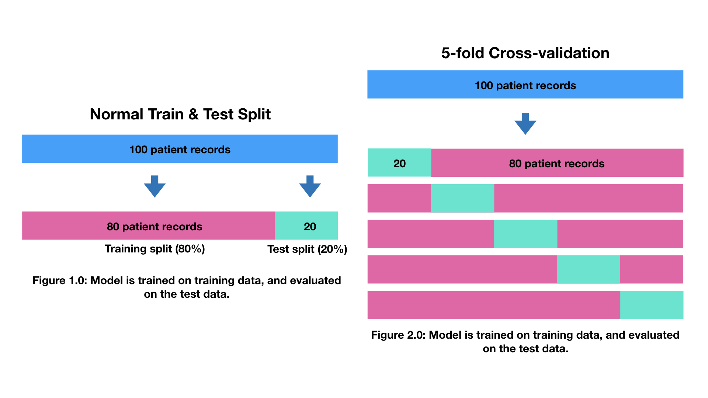
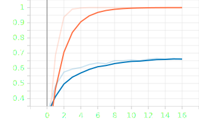

# Complete Machine Learning &amp; Data Science Bootcamp by Andrei Neagoie

Complete Machine Learning &amp; Data Science Bootcamp by Andrei Neagoie

> If we want to review all curriculums in jupyter notebook, \
> check https://github.com/mrdbourke/zero-to-mastery-ml.git \
> super-well-organized!

## Folder structure

- 11-prj-supervised-classification
  - heart disease
- 12-prj-supervised-regression
  - bulldozer price
- 14-prj-neural-networks-tensorflow
  - dog breed classification
  - 01-intro: (212. Google Colab Workspace - 230. Preparing Our Inputs and Outputs)
  - 02-build-model: (232. Building A Deep Learning Model - )

# Details

<details open>
  <summary>Click to Contract/Expend</summary>

## Section 2: Machine Learning 101

### 7. Exercise: Machine Learning Playground

[Teachable machine with google](https://teachablemachine.withgoogle.com/)

### 9. Exercise: YouTube Recommendation Engine

[ML Playground](https://ml-playground.com/)

### 10. Types of Machine Learning

- Supervicsed
  - classification
  - regression
- Unsupervices
  - clustering
  - assiciation rule learning
- Reinforcement
  - skill acquisition
  - real time learning

## Section 3: Machine Learning and Data Science Framework

## 16. Introducing Our Framework

1. Create a framework
2. Match to data science and machine learning tools
3. Learn by doing

### 17. 6 Step Machine Learning Framework

[A 6 Step Field Guide for Building Machine Learning Projects](https://www.mrdbourke.com/a-6-step-field-guide-for-building-machine-learning-projects/)


1. Data collection
2. Data modelling
   1. Problem definition
   - What problem are we trying to solve?
   2. Data
   - What data do we have?
   3. Evaluation
   - What defines success
   4. Features
   - What features should we model?
   5. Modelling
   - What kind of model should we use?
   6. Experimentation
   - What have we tried / what else ca we try?
3. Deployment

### 18. Types of Machine Learning Problems

- Supervised learning: "I know my inputs and outputs"
  - classification
    - binary classification: two options
    - multi-class classification: more than two options
  - refression
    - predict numbers
- Unsupervised learning: "I'm not sure of the outputs but I have inputs"
  - cluster
- Transfer learning: "I think my problem may be similar to something else"
- Reinforcement learning
  - real-time learning: e.g Alphago

#### When shouldn't you use machine learning?

- Will a simple hand-coded instruction based system work?

### 19. Types of Data

#### Structured/Unstructured

- Structured
  - excel, csv, etc.
- Unstructured
  - images?

#### Static/Streaming

- Static
  - csv
- Streaming

### 20. Types of Evaluation

| Classification | Regression                     | Recommendation |
| -------------- | ------------------------------ | -------------- |
| Accuracy       | Mean Absolute Error (MAE)      | Precision at K |
| Precision      | Mean Squared Error (MSE)       |                |
| Recall         | Root mean squared error (RMSE) |                |

### 21. Features In Data

- Numerical features
- Categorical features

Feature engineering: Looking at different features of data and creating new ones/altering existing ones

#### What features should you use?

Feature Coverage: How many samples have different features? Ideally, every sample has the same featuers

### 22. Modelling - Splitting Data

#### 3 parts to modelling

1. Choosing and training a model - training data
2. Tuning a model - validation data
3. Model comparison - test data

#### The most important concept in machine learning: The 3 sets

- Training (Course materials): eg. 70-80%
- Validation (Practice exam: eg. 10-15%)
- Test (Final exam: eg. 10-15%)

Generalization: The ability for a machine learning model to perform well on data it hasn't seen before

### 23. Modelling - Picking the Model

- Structured Data
  - CarBoost
  - Random Forest
- Unstructured Data
  - Deep Learning
  - Transfer Learning

> Goal! Minimise time between experiments

### 25. Modelling - Comparison

- Underfitting
  - Training: 64%, Test: 47%
- Balanced (Goldilocks zone)
  - Training: 98%, Test: 96%
- Overfitting
  - Training: 93%, Test: 99%

#### Fixes for overfitting and underfitting

- Underfitting
  - Try a more advanced model
  - Increase model hyperparameters
  - Reduce amount of features
  - Train longer
- Overfitting
  - Collect more data
  - Try a less advanced model

#### Things to remember

- Want to avoid overfitting and underfitting (head towards generality)
- Keep the test set separate at all costs
- Compare apples to apples
- One best performance metric does not equal best model

### 28. Tools We Will Use

- Overall
  - Anaconda
  - Jypiter
- Data anaysis
  - Pandas
  - matplotlib
  - NumPy
- Machine learning
  - TensorFlow
  - PyTorch
  - Scikit-learn
  - CatBoost
  - dmlc/XGBoost

### 29. Optional: Elements of AI

[Elements of AI](https://www.elementsofai.com/)

## Section 5: Data Science Environment Setup

### 35. What is Conda?

- Anaconda:
- miniconda:
- Conda : package manager

### 37. Mac Environment Setup

```sh
# Install miniconda
sh /Users/noah/Downloads/Miniconda3-latest-MacOSX-arm64.sh
# miniconda3 is installed in ~/miniconda3
# and also it will add conda setup to my ~/.zshrc file

# Create a virtual environment
(base) %
conda create --prefix ./env pandas numpy matplotlib scikit-learn

# To activate this environment, use
#
#     $ conda activate /Users/noah/Documents/study/study_codes/udemy/data-science-ml-andrei/data-science-ml-andrei-git/env
#
# To deactivate an active environment, use
#
#     $ conda deactivate
```

#### to remove (base)

delete conda setup in `~/.zshrc`

### 38. Mac Environment Setup 2

```sh
conda install jupyter
jupyter notebook
```

### 42. Sharing your Conda Environment

```sh
# export
conda env export --prefix ./env > environment.yml

# create env from the env file
# conda env create --file environment.yml --name env_from_file
# this will install the env_form_file in ~/miniconda3/envs
conda env create --file environment.yml --prefix ./env_from_file
```

### 43. Jupyter Notebook Walkthrough

`.ipynb` is the old name of jupyter notebook file

### 44. Jupyter Notebook Walkthrough 2

#### Short-cuts

- Command mode: Escape
- Input mode: Enter
- m (in command mode): to Markdown
- y (in command mode): to Code
- a: insert cell above
- b: insert cell above
- d, d: line delete
- Ctrl + Enter: Run Cells
- Shift + Enter: Run Cells and select below
- Opt + Enter: Run Cells and insert below
- Shift + Tab: display a hint

## Section 6: Pandas: Data Analysis

### 49. Series, Data Frames and CSVs


## Section 7: NumPy

### 60. NumPy Introduction

- It's fast
- Behind the scenes optimizations written in C
- Vectorization via broadcasting (avoiding loops)
- Backbone of other Pythen scientific packages

### 65. Viewing Arrays and Matrices

[numpy.unique documentation](https://numpy.org/doc/stable/reference/generated/numpy.unique.html)

- a1
  - Names: Array, ventor
  - 1-dimentional
  - Shape = (1, 3)
- a2
  - Names: Array, matrix
  - More than 1-dimentional
  - Shape = (2, 3)
- a3
  - Names: Array, matrix
  - More than 1-dimentional
  - Shape = (3, 2, 3)

### 66. Manipulating Arrays

[Numpy Broadcast Rule](https://numpy.org/doc/stable/user/basics.broadcasting.html)

### 67. Manipulating Arrays 2

#### Aggregation

```py
%timeit sum(massive_array) # Python's sum()
# 3.77 ms ± 120 µs per loop (mean ± std. dev. of 7 runs, 100 loops each)
%timeit np.sum(massive_array) # NumPy's sum()
# 20.2 µs ± 94.8 ns per loop (mean ± std. dev. of 7 runs, 10,000 loops each)
```

> NumPy's been optimized for numerical calculation so it's so much faster. \
> So when you can use numpy functions, use numpy one!

#### Standard deviation

a measure of how spread out a group of numbers is from the mean

```py
np.std(a2)
```

#### Variance

a measure of the avaerage degree to which each number is different to the mean

- Higher variance = wider range of numbers
- Logher variance = lower range of numbers

```py
np.var(a2)
```

### 70. Dot Product vs Element Wise

- [Matrix Multiplication Website](http://matrixmultiplication.xyz/)
- [Matrix Multiplying Explanation](https://www.mathsisfun.com/algebra/matrix-multiplying.html)

### 71. Exercise: Nut Butter Store Sales

|       | Almont butter | Peanut butter | Cashew butter | Total ($) |
| ----- | ------------- | ------------- | ------------- | --------- |
| Mon   | 2             | 7             | 1             | 88        |
| Tues  | 9             | 4             | 16            | 314       |
| Wed   | 11            | 14            | 18            | 438       |
| Thurs | 13            | 13            | 16            | 426       |
| Fri   | 15            | 18            | 9             | 402       |

|       | Almont butter | Peanut butter | Cashew butter |
| ----- | ------------- | ------------- | ------------- |
| Price | 10            | 8             | 12            |

!Calculate Total ($) using numpy dot product

### 72. Comparison Operators

[NumPy Logic functions](https://numpy.org/doc/stable/reference/routines.logic.html)

### 77. Optional: Extra NumPy resources

[A Visual Introduction to NumPy by Jay Alammar](http://jalammar.github.io/visual-numpy/)

## Section 8: Matplotlib: Plotting and Data Visualization

### 80. Importing And Using Matplotlib

- [matplotlib lifecycle](https://matplotlib.org/stable/tutorials/introductory/lifecycle.html)
- In general, try to use the Object-Oriented interface over the pyplot interface

### 81. Anatomy Of A Matplotlib Figure


### 82. Scatter Plot And Bar Plot

Examples to create mock data

```py
# Create some data
x = np.linspace(0, 10, 100)
x[:10]

# Plot the data and create a line plot
fig, ax = plt.subplots()
ax.plot(x, x**2)

# Use same data to create a scatter plot
fig, ax = plt.subplots()
ax.scatter(x, np.exp(x))

# Another scatter plot
fig, ax = plt.subplots()
ax.scatter(x, np.sin(x))
```

### 86. Plotting From Pandas DataFrames

[Pandas Chart Vusialization](https://pandas.pydata.org/docs/user_guide/visualization.html)

### 95. Customizing Your Plots 2

[matplotlib colormap reference](https://matplotlib.org/stable/gallery/color/colormap_reference.html)

### 96. Saving And Sharing Your Plots

```py
fig, (ax0, ax1) = plt.subplots(nrows=2,
                               ncols=1,
                               figsize=(10, 10))
fig.savefig("heart-disease-analysis-plot-saved-with-code.png")
```

## Section 9: Scikit-learn: Creating Machine Learning Models

### 99. Scikit-learn Introduction

[Scikit Learn - User Guide](https://scikit-learn.org/stable/user_guide.html)

- An end-to-end Scikit-Learn workflow
- Getting data ready (to be used with machine learning models)
- Choosing a machine learning model
- Fitting a model to the data (learning patterns)
- Making predictions with a model (using patterns)
- Evaluating model predictions
- Improving model predictions
- Saving and loading models

### 105. Optional: Debugging Warnings In Jupyter

```sh
conda activate ./env
conda list
conda update scikit-learn
conda list scikit-learn
conda search scikit-learn
conda search scikit-learn --info
# conda install python=3.6.9 scikit-learn=0.22
```

### 107. Quick Tip: Clean, Transform, Reduce

Clean Data (empty or missing data)\
-> Transform Data(computer understands) \
-> Reduce Data(resource manage)

### 108. Getting Your Data Ready: Convert Data To Numbers

```py
from sklearn.ensemble import RandomForestRegressor  # it can predict number
```

### 114. NEW: Choosing The Right Model For Your Data

- [scikit-learn Machine Learning Map](https://scikit-learn.org/stable/tutorial/machine_learning_map/index.html)
- [scikit-learn Datasets](https://scikit-learn.org/stable/datasets.html)
- [scikit-learn Realworld dataset](https://scikit-learn.org/stable/datasets/real_world.html)
  - [california housing](https://scikit-learn.org/stable/datasets/real_world.html#california-housing-dataset)

```py
R_squared = model.score(X_test, y_test) # Return the coefficient of determination of the prediction.
```

### 115. NEW: Choosing The Right Model For Your Data 2 (Regression)

[Random Forest Explanation](https://williamkoehrsen.medium.com/random-forest-simple-explanation-377895a60d2d)

### 116. Quick Note: Decision Trees

RandomForrestRegressor is based on what we call a Decision Tree algorithm.

### 120. Making Predictions With Our Model

```py
# evaluation 1
# Compare predictions to truth labels to evaluate the model
y_preds = clf.predict(X_test)
np.mean(y_preds == y_test)

# evaluation 2
clf.score(X_test, y_test)

# evaluation 3
from sklearn.metrics import accuracy_score
accuracy_score(y_test, y_preds)
```

### 121. predict() vs predict_proba()

```py
# predict_proba() returns probabilities of a classification label
clf.predict_proba(X_test[:5])
# array([[0.89, 0.11],
#        [0.49, 0.51],
#        [0.43, 0.57],
#        [0.84, 0.16],
#        [0.18, 0.82]])
```

### 123. NEW: Evaluating A Machine Learning Model (Score) Part 1

[sklearn regression evaluation](https://scikit-learn.org/stable/modules/model_evaluation.html)

### 125. Evaluating A Machine Learning Model 2 (Cross Validation)

> Use this kind of scoring strategy to avoid getting lucky score

```py
from sklearn.model_selection import cross_val_score
cross_val_score(clf, X, y, cv=5)
# array([0.90322581, 0.83870968, 0.87096774, 0.9       , 0.86666667,
#        0.8       , 0.76666667, 0.83333333, 0.73333333, 0.83333333])
```



- [ROC and AUC, Clearly Explained!](https://www.youtube.com/watch?v=4jRBRDbJemM) by StatQuest
- ROC documentation in Scikit-Learn (contains code examples)
- How the ROC curve and AUC are calculated by Google's Machine Learning team

### 130. Evaluating A Classification Model 4 (Confusion Matrix)

#### Install seaborn package in Jupyter notebook

```py
# How to install a conda package into the current environment from a Jupyter Notebook
import sys
%conda install seaborn --yes --prefix {sys.prefix}
```

```sh
# or install in terminal
conda install seaborn
```

### 132. Evaluating A Classification Model 6 (Classification Report)

[3.3. Metrics and scoring: quantifying the quality of predictions](https://scikit-learn.org/stable/modules/model_evaluation.html)

### 136. Machine Learning Model Evaluation

Evaluating the results of a machine learning model is as important as building one.

But just like how different problems have different machine learning models, different machine learning models have different evaluation metrics.

Below are some of the most important evaluation metrics you'll want to look into for classification and regression models.

#### Classification Model Evaluation Metrics/Techniques

- Accuracy - The accuracy of the model in decimal form. Perfect accuracy is equal to 1.0.
- [Precision](https://scikit-learn.org/stable/modules/generated/sklearn.metrics.precision_score.html#sklearn.metrics.precision_score) - Indicates the proportion of positive identifications (model predicted class 1) which were actually correct. A model which produces no false positives has a precision of 1.0.
- [Recall](https://scikit-learn.org/stable/modules/generated/sklearn.metrics.recall_score.html#sklearn.metrics.recall_score) - Indicates the proportion of actual positives which were correctly classified. A model which produces no false negatives has a recall of 1.0.
- [F1 score](https://scikit-learn.org/stable/modules/generated/sklearn.metrics.f1_score.html#sklearn.metrics.f1_score) - A combination of precision and recall. A perfect model achieves an F1 score of 1.0.
- [Confusion matrix](https://www.dataschool.io/simple-guide-to-confusion-matrix-terminology/) - Compares the predicted values with the true values in a tabular way, if 100% correct, all values in the matrix will be top left to bottom right (diagonal line).
- [Cross-validation](https://scikit-learn.org/stable/modules/cross_validation.html) - Splits your dataset into multiple parts and train and tests your model on each part then evaluates performance as an average.
- [Classification report](https://scikit-learn.org/stable/modules/generated/sklearn.metrics.classification_report.html) - Sklearn has a built-in function called `classification_report()` which returns some of the main classification metrics such as precision, recall and f1-score.
- [ROC Curve](https://scikit-learn.org/stable/modules/generated/sklearn.metrics.roc_curve.html) - Also known as [receiver operating characteristic](https://en.wikipedia.org/wiki/Receiver_operating_characteristic) is a plot of true positive rate versus false-positive rate.
- [Area Under Curve (AUC) Score](https://scikit-learn.org/stable/modules/generated/sklearn.metrics.roc_auc_score.html) - The area underneath the ROC curve. A perfect model achieves an AUC score of 1.0.

#### Which classification metric should you use?

- **Accuracy** is a good measure to start with if all classes are balanced (e.g. same amount of samples which are labelled with 0 or 1).
- **Precision** and **recall** become more important when classes are imbalanced.
- If false-positive predictions are worse than false-negatives, aim for higher precision.
- If false-negative predictions are worse than false-positives, aim for higher recall.
- **F1-score** is a combination of precision and recall.
- A confusion matrix is always a good way to visualize how a classification model is going.

#### Regression Model Evaluation Metrics/Techniques

- [R^2 (pronounced r-squared) or the coefficient of determination](https://scikit-learn.org/stable/modules/generated/sklearn.metrics.r2_score.html) - Compares your model's predictions to the mean of the targets. Values can range from negative infinity (a very poor model) to 1. For example, if all your model does is predict the mean of the targets, its R^2 value would be 0. And if your model perfectly predicts a range of numbers it's R^2 value would be 1.
- [Mean absolute error (MAE)](https://scikit-learn.org/stable/modules/generated/sklearn.metrics.mean_absolute_error.html) - The average of the absolute differences between predictions and actual values. It gives you an idea of how wrong your predictions were.
- [Mean squared error (MSE)](https://scikit-learn.org/stable/modules/generated/sklearn.metrics.mean_squared_error.html) - The average squared differences between predictions and actual values. Squaring the errors removes negative errors. It also amplifies outliers (samples which have larger errors).

#### Which regression metric should you use?

- **R2** is similar to accuracy. It gives you a quick indication of how well your model might be doing. Generally, the closer your **R2** value is to 1.0, the better the model. But it doesn't really tell exactly how wrong your model is in terms of how far off each prediction is.
- **MAE** gives a better indication of how far off each of your model's predictions are on average.
- As for **MAE** or **MSE**, because of the way MSE is calculated, squaring the differences between predicted values and actual values, it amplifies larger differences. Let's say we're predicting the value of houses (which we are).
  - Pay more attention to MAE: When being $10,000 off is **twice** as bad as being $5,000 off.
  - Pay more attention to MSE: When being $10,000 off is **more than twice** as bad as being $5,000 off.

For more resources on evaluating a machine learning model, be sure to check out the following resources:

- [Scikit-Learn documentation for metrics and scoring (quantifying the quality of predictions)](https://scikit-learn.org/stable/modules/model_evaluation.html)
- [Beyond Accuracy: Precision and Recall by Will Koehrsen](https://towardsdatascience.com/beyond-accuracy-precision-and-recall-3da06bea9f6c)
- [Stack Overflow answer describing MSE (mean squared error) and RSME (root mean squared error)](https://stackoverflow.com/questions/17197492/is-there-a-library-function-for-root-mean-square-error-rmse-in-python/37861832#37861832)

### 162. Choosing The Right Models

> Google it\
> [Top 6 Machine Learning Algorithms for Classification](https://towardsdatascience.com/top-machine-learning-algorithms-for-classification-2197870ff501)

## Section 12: Milestone Project 2: Supervised Learning (Time Series Data)

### 175. Project Overview

Bulldozers price decision

[Blue Book for Bulldozers](https://www.kaggle.com/c/bluebook-for-bulldozers/overview)

### 177. Project Environment Setup

[Data Description - Kaggle](https://www.kaggle.com/competitions/bluebook-for-bulldozers/data)

#### The data for this competition is split into three parts:

- Train.csv is the training set, which contains data through the end of 2011.
- Valid.csv is the validation set, which contains data from January 1, 2012 - April 30, 2012 You make predictions on this set throughout the majority of the competition. Your score on this set is used to create the public leaderboard.
- Test.csv is the test set, which won't be released until the last week of the competition. It contains data from May 1, 2012 - November 2012. Your score on the test set determines your final rank for the competition.

#### The key fields are in train.csv are:

- SalesID: the uniue identifier of the sale
- MachineID: the unique identifier of a machine. A machine can be sold multiple times
- saleprice: what the machine sold for at auction (only provided in train.csv)
- saledate: the date of the sale

## Section 14: Neural Networks: Deep Learning, Transfer Learning and TensorFlow 2

### 211. Setting Up Google Colab

- [Kaggle - Dog breed identification](https://www.kaggle.com/competitions/dog-breed-identification/data)
- [Google Colab - External data example](https://colab.research.google.com/notebooks/io.ipynb)

#### Let's start!

- [Google Colab](https://colab.research.google.com/)
- New notbook

### 212. Google Colab Workspace

[Google Colab FAQ](https://research.google.com/colaboratory/faq.html)

```sh
!unzip "drive/MyDrive/Colab Notebooks/data/dog-breed-identification.zip" -d "drive/MyDrive/Colab Notebooks/data/dog-vision"
```

### 218. Using A GPU

Runtime -> Change runtime type -> Hardware accelerator: GPU

### 221. Loading Our Data Labels

- Google Colab short-cut list: `Comm + M + H`
- See the docstring: `Shift + Comm + Space`

### 225. Preprocess Images

- [Tensorflow data loading](https://www.tensorflow.org/guide/data)
- [Tensorflow Load and Preprocess images](https://www.tensorflow.org/tutorials/load_data/images)

### 227. Turning Data Into Batches

- [Yann Lecun batch size](https://twitter.com/ylecun/status/989610208497360896?lang=en)
- Jeremy Howard batch size

### 231. Optional: How machines learn and what's going on behind the scenes?

- [How Machines Learn](https://www.youtube.com/watch?v=R9OHn5ZF4Uo)
- [But what is a neural network? | Chapter 1, Deep learning](https://www.youtube.com/watch?v=aircAruvnKk)

### 232. Building A Deep Learning Model

- [Tensorflow Hub - machine model in cloud](https://www.tensorflow.org/hub)
- [PyTorch Hub - machine model in cloud](https://pytorch.org/hub/)
- [Paper Switch Code - machine model in cloud](https://paperswithcode.com/)

- [TensorFlow Hub Dev](https://tfhub.dev/)
- [mobilenet model](https://tfhub.dev/google/imagenet/mobilenet_v2_130_224/classification/5)
- [PyTorch at Tesla by Andrej Karpathy, Tesla](https://www.youtube.com/watch?v=oBklltKXtDE&t=173s)

### 233. Building A Deep Learning Model 2

- [Keras - Python deeplearning API](https://keras.io/)
- [TF-Keras - Sequential model](https://www.tensorflow.org/guide/keras/sequential_model)
- [TF-Keras - Functional](https://www.tensorflow.org/guide/keras/functional)

### 234. Building A Deep Learning Model 3

- [Review: MobileNetV2 — Light Weight Model (Image Classification)](https://towardsdatascience.com/review-mobilenetv2-light-weight-model-image-classification-8febb490e61c)
- [Convolutional Neural Networks — the ELI5 way](https://towardsdatascience.com/a-comprehensive-guide-to-convolutional-neural-networks-the-eli5-way-3bd2b1164a53)
- [Softmax function](https://en.wikipedia.org/wiki/Softmax_function)

#### Layers

|            | Binary classification | Multi-class classification |
| ---------- | --------------------- | -------------------------- |
| Activation | sigmoid               | softmax                    |
| Loss       | Binary Cross Entropy  | Category Cross Entropy     |

### 237. Evaluating Our Model

[Tensorflow Tensorboard](https://www.tensorflow.org/api_docs/python/tf/keras/callbacks/TensorBoard)

### 238. Preventing Overfitting

[Tensorflow - Early Stopping Callback](https://www.tensorflow.org/api_docs/python/tf/keras/callbacks/EarlyStopping)

### 240. Evaluating Performance With TensorBoard



<!--  -->

## Section 15: Storytelling + Communication: How To Present Your Work

### 259. Communicating and sharing your work: Further reading

- [How to Think About Communicating and Sharing Your Technical Work](https://www.mrdbourke.com/how-to-think-about-communicating-and-sharing-your-work/)
- [Basecamp’s guide to internal communication](https://37signals.com/thoughts)
- [You Should Blog by Jeremy Howard from fast.ai](https://www.fast.ai/posts/2020-01-16-fast_template.html)
- [Why you (yes, you) should blog by Rachel Thomas from fast.ai](https://medium.com/@racheltho/why-you-yes-you-should-blog-7d2544ac1045)

</details>
