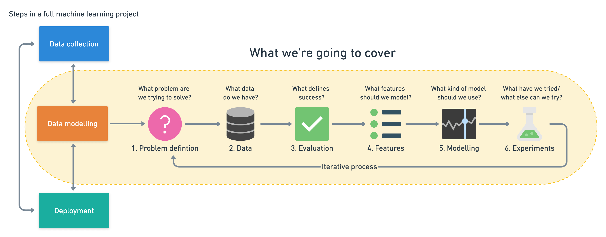
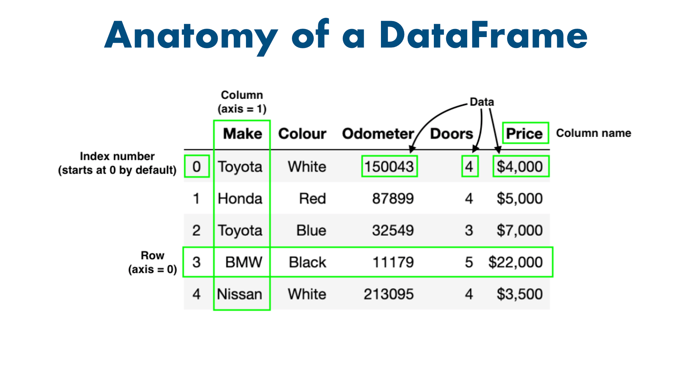
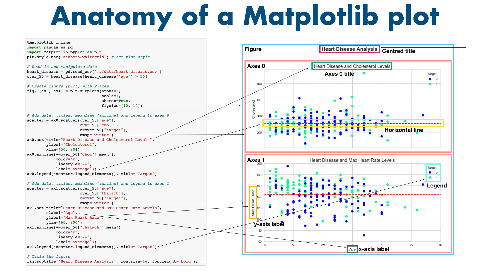

# Complete Machine Learning &amp; Data Science Bootcamp by Andrei Neagoie

Complete Machine Learning &amp; Data Science Bootcamp by Andrei Neagoie

> If we want to review all curriculums in jupyter notebook, \
> check https://github.com/mrdbourke/zero-to-mastery-ml.git \
> super-well-organized!

## Folder structure

-

# Details

<details open>
  <summary>Click to Contract/Expend</summary>

## Section 2: Machine Learning 101

### 7. Exercise: Machine Learning Playground

[Teachable machine with google](https://teachablemachine.withgoogle.com/)

### 9. Exercise: YouTube Recommendation Engine

[ML Playground](https://ml-playground.com/)

### 10. Types of Machine Learning

- Supervicsed
  - classification
  - regression
- Unsupervices
  - clustering
  - assiciation rule learning
- Reinforcement
  - skill acquisition
  - real time learning

## Section 3: Machine Learning and Data Science Framework

## 16. Introducing Our Framework

1. Create a framework
2. Match to data science and machine learning tools
3. Learn by doing

### 17. 6 Step Machine Learning Framework

[A 6 Step Field Guide for Building Machine Learning Projects](https://www.mrdbourke.com/a-6-step-field-guide-for-building-machine-learning-projects/)



1. Data collection
2. Data modelling
   1. Problem definition
   - What problem are we trying to solve?
   2. Data
   - What data do we have?
   3. Evaluation
   - What defines success
   4. Features
   - What features should we model?
   5. Modelling
   - What kind of model should we use?
   6. Experimentation
   - What have we tried / what else ca we try?
3. Deployment

### 18. Types of Machine Learning Problems

- Supervised learning: "I know my inputs and outputs"
  - classification
    - binary classification: two options
    - multi-class classification: more than two options
  - refression
    - predict numbers
- Unsupervised learning: "I'm not sure of the outputs but I have inputs"
  - cluster
- Transfer learning: "I think my problem may be similar to something else"
- Reinforcement learning
  - real-time learning: e.g Alphago

#### When shouldn't you use machine learning?

- Will a simple hand-coded instruction based system work?

### 19. Types of Data

#### Structured/Unstructured

- Structured
  - excel, csv, etc.
- Unstructured
  - images?

#### Static/Streaming

- Static
  - csv
- Streaming

### 20. Types of Evaluation

| Classification | Regression                     | Recommendation |
| -------------- | ------------------------------ | -------------- |
| Accuracy       | Mean Absolute Error (MAE)      | Precision at K |
| Precision      | Mean Squared Error (MSE)       |                |
| Recall         | Root mean squared error (RMSE) |                |

### 21. Features In Data

- Numerical features
- Categorical features

Feature engineering: Looking at different features of data and creating new ones/altering existing ones

#### What features should you use?

Feature Coverage: How many samples have different features? Ideally, every sample has the same featuers

### 22. Modelling - Splitting Data

#### 3 parts to modelling

1. Choosing and training a model - training data
2. Tuning a model - validation data
3. Model comparison - test data

#### The most important concept in machine learning: The 3 sets

- Training (Course materials): eg. 70-80%
- Validation (Practice exam: eg. 10-15%)
- Test (Final exam: eg. 10-15%)

Generalization: The ability for a machine learning model to perform well on data it hasn't seen before

### 23. Modelling - Picking the Model

- Structured Data
  - CarBoost
  - Random Forest
- Unstructured Data
  - Deep Learning
  - Transfer Learning

> Goal! Minimise time between experiments

### 25. Modelling - Comparison

- Underfitting
  - Training: 64%, Test: 47%
- Balanced (Goldilocks zone)
  - Training: 98%, Test: 96%
- Overfitting
  - Training: 93%, Test: 99%

#### Fixes for overfitting and underfitting

- Underfitting
  - Try a more advanced model
  - Increase model hyperparameters
  - Reduce amount of features
  - Train longer
- Overfitting
  - Collect more data
  - Try a less advanced model

#### Things to remember

- Want to avoid overfitting and underfitting (head towards generality)
- Keep the test set separate at all costs
- Compare apples to apples
- One best performance metric does not equal best model

### 28. Tools We Will Use

- Overall
  - Anaconda
  - Jypiter
- Data anaysis
  - Pandas
  - matplotlib
  - NumPy
- Machine learning
  - TensorFlow
  - PyTorch
  - Scikit-learn
  - CatBoost
  - dmlc/XGBoost

### 29. Optional: Elements of AI

[Elements of AI](https://www.elementsofai.com/)

## Section 5: Data Science Environment Setup

### 35. What is Conda?

- Anaconda:
- miniconda:
- Conda : package manager

### 37. Mac Environment Setup

```sh
# Install miniconda
sh /Users/noah/Downloads/Miniconda3-latest-MacOSX-arm64.sh
# miniconda3 is installed in ~/miniconda3
# and also it will add conda setup to my ~/.zshrc file

# Create a virtual environment
(base) %
conda create --prefix ./env pandas numpy matplotlib scikit-learn

# To activate this environment, use
#
#     $ conda activate /Users/noah/Documents/study/study_codes/udemy/data-science-ml-andrei/data-science-ml-andrei-git/env
#
# To deactivate an active environment, use
#
#     $ conda deactivate
```

#### to remove (base)

delete conda setup in `~/.zshrc`

### 38. Mac Environment Setup 2

```sh
conda install jupyter
jupyter notebook
```

### 42. Sharing your Conda Environment

```sh
# export
conda env export --prefix ./env > environment.yml

# create env from the env file
# conda env create --file environment.yml --name env_from_file
# this will install the env_form_file in ~/miniconda3/envs
conda env create --file environment.yml --prefix ./env_from_file
```

### 43. Jupyter Notebook Walkthrough

`.ipynb` is the old name of jupyter notebook file

### 44. Jupyter Notebook Walkthrough 2

#### Short-cuts

- Command mode: Escape
- Input mode: Enter
- m (in command mode): to Markdown
- y (in command mode): to Code
- a: insert cell above
- b: insert cell above
- d, d: line delete
- Ctrl + Enter: Run Cells
- Shift + Enter: Run Cells and select below
- Opt + Enter: Run Cells and insert below
- Shift + Tab: display a hint

## Section 6: Pandas: Data Analysis

### 49. Series, Data Frames and CSVs



## Section 7: NumPy

### 60. NumPy Introduction

- It's fast
- Behind the scenes optimizations written in C
- Vectorization via broadcasting (avoiding loops)
- Backbone of other Pythen scientific packages

### 65. Viewing Arrays and Matrices

[numpy.unique documentation](https://numpy.org/doc/stable/reference/generated/numpy.unique.html)

- a1
  - Names: Array, ventor
  - 1-dimentional
  - Shape = (1, 3)
- a2
  - Names: Array, matrix
  - More than 1-dimentional
  - Shape = (2, 3)
- a3
  - Names: Array, matrix
  - More than 1-dimentional
  - Shape = (3, 2, 3)

### 66. Manipulating Arrays

[Numpy Broadcast Rule](https://numpy.org/doc/stable/user/basics.broadcasting.html)

### 67. Manipulating Arrays 2

#### Aggregation

```py
%timeit sum(massive_array) # Python's sum()
# 3.77 ms ± 120 µs per loop (mean ± std. dev. of 7 runs, 100 loops each)
%timeit np.sum(massive_array) # NumPy's sum()
# 20.2 µs ± 94.8 ns per loop (mean ± std. dev. of 7 runs, 10,000 loops each)
```

> NumPy's been optimized for numerical calculation so it's so much faster. \
> So when you can use numpy functions, use numpy one!

#### Standard deviation

a measure of how spread out a group of numbers is from the mean

```py
np.std(a2)
```

#### Variance

a measure of the avaerage degree to which each number is different to the mean

- Higher variance = wider range of numbers
- Logher variance = lower range of numbers

```py
np.var(a2)
```

### 70. Dot Product vs Element Wise

- [Matrix Multiplication Website](http://matrixmultiplication.xyz/)
- [Matrix Multiplying Explanation](https://www.mathsisfun.com/algebra/matrix-multiplying.html)

### 71. Exercise: Nut Butter Store Sales

|       | Almont butter | Peanut butter | Cashew butter | Total ($) |
| ----- | ------------- | ------------- | ------------- | --------- |
| Mon   | 2             | 7             | 1             | 88        |
| Tues  | 9             | 4             | 16            | 314       |
| Wed   | 11            | 14            | 18            | 438       |
| Thurs | 13            | 13            | 16            | 426       |
| Fri   | 15            | 18            | 9             | 402       |

|       | Almont butter | Peanut butter | Cashew butter |
| ----- | ------------- | ------------- | ------------- |
| Price | 10            | 8             | 12            |

!Calculate Total ($) using numpy dot product

### 72. Comparison Operators

[NumPy Logic functions](https://numpy.org/doc/stable/reference/routines.logic.html)

### 77. Optional: Extra NumPy resources

[A Visual Introduction to NumPy by Jay Alammar](http://jalammar.github.io/visual-numpy/)

## Section 8: Matplotlib: Plotting and Data Visualization

### 80. Importing And Using Matplotlib

- [matplotlib lifecycle](https://matplotlib.org/stable/tutorials/introductory/lifecycle.html)
- In general, try to use the Object-Oriented interface over the pyplot interface

### 81. Anatomy Of A Matplotlib Figure



### 86. Plotting From Pandas DataFrames

[Pandas Chart Vusialization](https://pandas.pydata.org/docs/user_guide/visualization.html)

</details>
